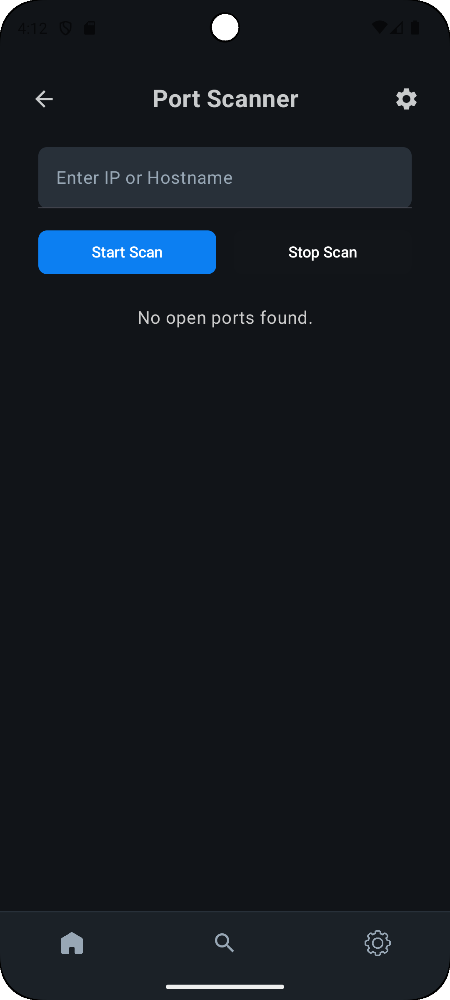
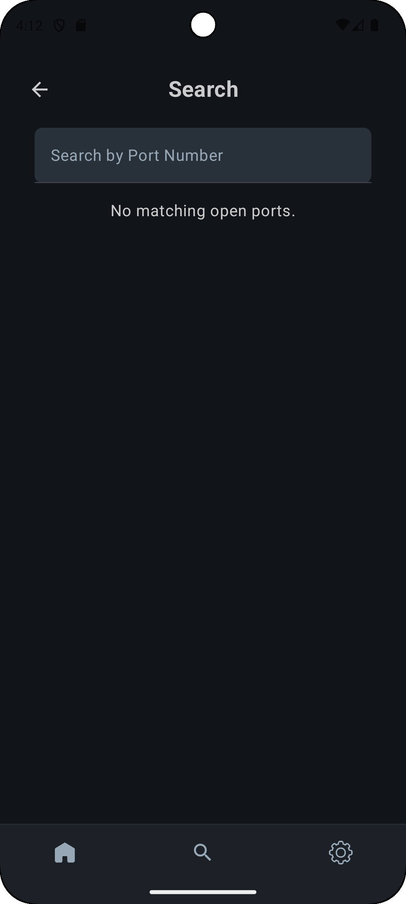
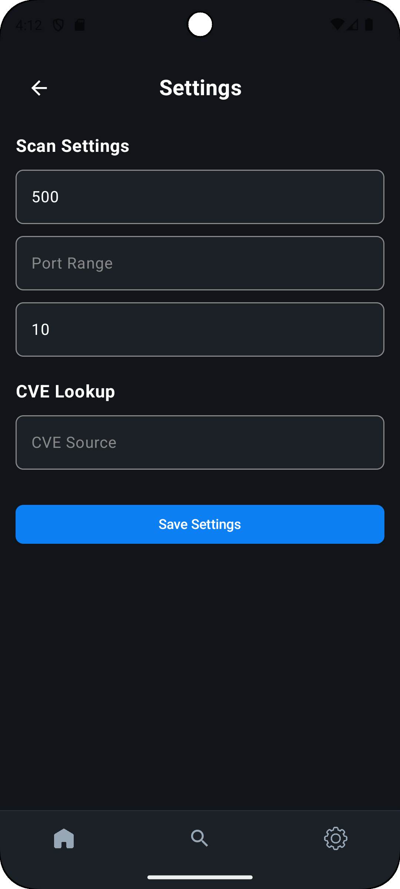

# 🔍 Android Port Scanner

An Android app built with **Jetpack Compose** that performs network port scanning on a given IP address or hostname. This tool is ideal for quickly checking open ports on remote machines—right from your phone.

---

## ✨ Features

- 📡 Scan open ports of any IP address or hostname
- 🎛️ Custom settings: timeout, thread count, and port range
- 📈 Real-time progress indicator while scanning
- ⚡ Built with Jetpack Compose and Kotlin
- 🎨 Clean and modern UI

---
## 📸 Screenshots

| Home Screen | Scanning Ports | Settings |
|-------------|----------------|----------|
|  |  |  |

> 📌 To see the app in action, clone and run it on an emulator or Android device.

---

## 🚀 Getting Started

### Prerequisites
- Android Studio (Flamingo or later recommended)
- Android SDK 31 or higher

### Installation

```bash
git clone https://github.com/your-username/android-port-scanner.git
cd android-port-scanner
